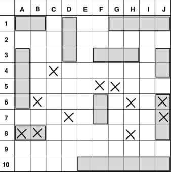

# Battleships project

### Pre-game info.

All ship's configurations should be input in format A1 R L. No spaces after L.
Same rules apply when creating own configuration file.
A1 is an initial tile. R is a direction which the ship expands at. L is a ship's length.
All ships could be input in random order.
Standard way to input file path C:\\Users\\Username\\Documents\\Battleships1.txt.
There are two example files with valid ship's configurations in project compressed folder.

### Using preset boards (optional).

Preset boards are to be defined in .txt file.
If user chose loading from file , in case of incorrect preset, user could correct it.

### Board builder.

* Used for creating board manually by player.
* Add new ships, edit existing ones, see current board.

### Gameplay.

* Players take turns attacking each other.
* Each turn, the player can see his own board and the board with hits.
* When a player destroys all opponent's ships, game ends

  

